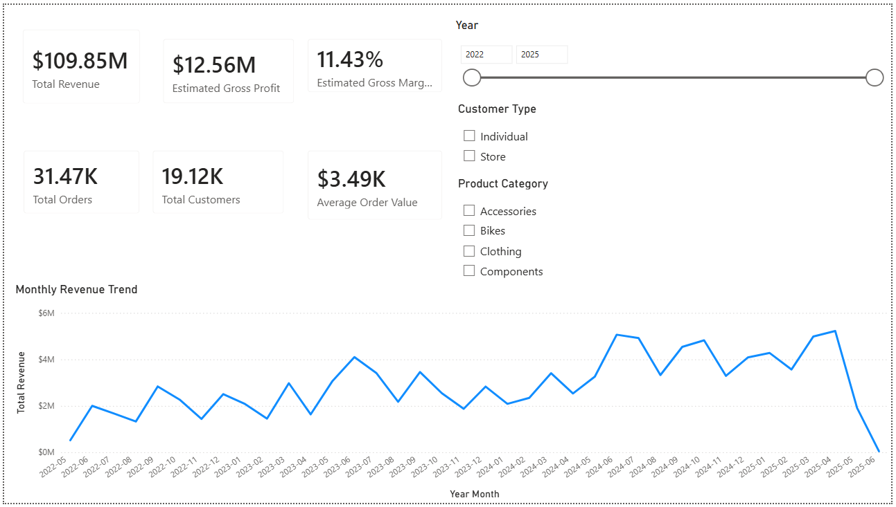
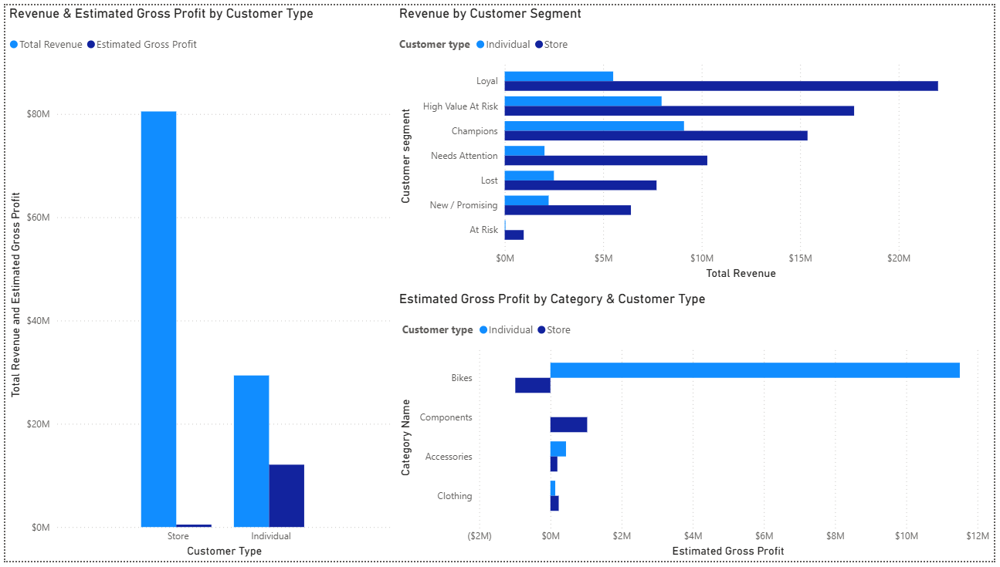
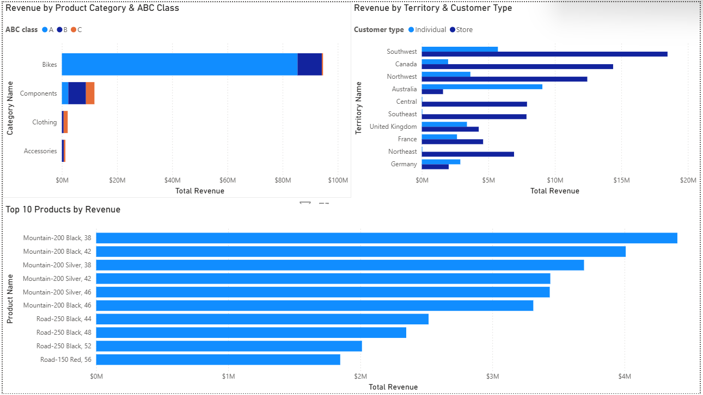

# AdventureWorks Sales & Customer Analytics

**Tech Stack:** SQL Server · T-SQL · SSMS · Power BI · DAX · GitHub

## Project Highlights

* **31,465** orders analyzed
* **19,119** customers analyzed
* **$109.85M** total revenue
* RFM customer segmentation
* ABC / Pareto product analysis
* Customer profitability analysis
* Product, seasonality, and geographic analysis
* Interactive **3-page Power BI dashboard**

---

## Project Overview

This project analyzes the **AdventureWorks2025 OLTP** database to identify key sales, customer, product, profitability, seasonal, and geographic patterns.

The project follows an end-to-end analytics workflow:

1. Database exploration in SQL Server
2. Data model and relationship analysis
3. Sales and customer analysis using T-SQL
4. RFM customer segmentation
5. Product ABC / Pareto analysis
6. Pricing and estimated profitability analysis
7. Seasonality and sales-channel investigation
8. Geographic analysis
9. SQL analytical view creation
10. Power BI data modeling and dashboard development

The analysis focuses on practical business questions such as:

* Which customers and customer segments generate the most revenue?
* How different are B2B Store customers and B2C Individual customers?
* Which product categories and SKUs drive revenue and profitability?
* Are the highest-revenue customers also the most profitable?
* Which customers may be at risk of becoming inactive?
* How concentrated is revenue across the product portfolio?
* How do performance patterns differ across territories and sales channels?
* What seasonal trends exist in product demand?

---

## Tools & Technologies

* **Microsoft SQL Server 2025**
* **SQL Server Management Studio (SSMS)**
* **T-SQL**
* **Power BI Desktop**
* **DAX**
* **Git / GitHub**

---

## Data Source

The project uses Microsoft's **AdventureWorks2025 OLTP** sample database, restored locally in SQL Server.

**Analysis period:** 30 May 2022 – 29 June 2025

The database contains transactional information related to:

* Sales orders
* Customers
* Products
* Product categories
* Sales territories
* Historical product costs
* Historical list prices

For order-level analysis, revenue is based on:

```sql
Sales.SalesOrderHeader.SubTotal
```

For product-level analysis, revenue is based on:

```sql
Sales.SalesOrderDetail.LineTotal
```

Tax and freight are excluded from the main revenue calculations.

---

## Database Exploration

Initial database exploration identified **71 base tables** across multiple schemas.

The analysis focused mainly on:

* `Sales`
* `Production`
* `Person`

Core tables included:

* `Sales.SalesOrderHeader`
* `Sales.SalesOrderDetail`
* `Sales.Customer`
* `Sales.SalesTerritory`
* `Production.Product`
* `Production.ProductSubcategory`
* `Production.ProductCategory`
* `Production.ProductCostHistory`
* `Production.ProductListPriceHistory`

The structure and relationships between these tables were investigated before building analytical queries and the Power BI model.

---

## Core KPIs

Across the full analysis period:

* **Total Orders:** 31,465
* **Total Customers:** 19,119
* **Total Revenue:** $109.85M
* **Average Order Value:** $3.49K
* **Estimated Gross Profit:** approximately $12.56M
* **Estimated Gross Margin:** approximately 11.43%

---

## Customer Analysis

### Repeat Purchase Behaviour

Customers were classified as either one-time or repeat customers.

* **60.93%** of customers purchased only once
* **39.07%** were repeat customers
* Repeat customers generated **93.84% of total revenue**

However, this result is strongly influenced by customer type.

Only **605 repeat Store customers generated approximately $80.47M**, representing approximately **73.25% of total company revenue**.

Repeat Individual customers also significantly outperform one-time Individual customers:

* **One-time Individual average customer revenue:** approximately $581
* **Repeat Individual average customer revenue:** approximately $3.29K

This demonstrates that customer type is an important factor when interpreting retention metrics.

### Repeat Purchase Intervals

Among repeat purchase intervals:

* **0–30 days:** 10.24%
* **31–90 days:** 14.70%
* **91–180 days:** 30.30%
* **181–365 days:** 16.52%
* **More than 365 days:** 28.24%

Overall:

* **55.24%** of repeat purchases occurred within 180 days
* **71.76%** occurred within one year

---

## RFM Customer Segmentation

Customers were segmented using **Recency, Frequency, and Monetary value (RFM)**.

RFM scores were calculated separately for Store and Individual customers using percentile-based ranking. This prevents customers with identical values from receiving inconsistent scores due only to row ordering.

Customer segments include:

* Champions
* Loyal
* New / Promising
* High Value At Risk
* At Risk
* Lost
* Needs Attention

### Individual Customers

* **Champions:** 31.00% of Individual revenue
* **High Value At Risk:** 27.13%
* **Loyal:** 18.76%

Together, Champions, Loyal, and High Value At Risk customers generate approximately **76.9% of Individual revenue**.

### Store Customers

* **Loyal:** 27.33% of Store revenue
* **High Value At Risk:** 22.04%
* **Champions:** 19.10%

Only **48 High Value At Risk Store customers represent approximately $17.74M in historical revenue**, highlighting significant potential exposure to a small number of inactive high-value B2B customers.

---

## Product Performance

Revenue is highly concentrated in the Bikes category.

### Revenue by Category

* **Bikes:** 86.17%
* **Components:** 10.74%
* **Clothing:** 1.93%
* **Accessories:** 1.16%

Accessories appear in a large number of orders but contribute relatively little revenue, demonstrating that purchase frequency does not necessarily indicate financial importance.

### Revenue by Subcategory

Three bike subcategories dominate product revenue:

* **Road Bikes:** 39.97%
* **Mountain Bikes:** 33.18%
* **Touring Bikes:** 13.01%

Together, these three subcategories generate approximately **86.16% of total product revenue**.

In contrast, Tires and Tubes appear in more than **10,000 orders** but generate only approximately **0.22% of total revenue**.

---

## ABC / Pareto Analysis

Products were classified into ABC classes based on cumulative revenue contribution.

* **Class A:** products responsible for approximately the first 80% of cumulative revenue
* **Class B:** products responsible for approximately the next 15%
* **Class C:** products responsible for approximately the remaining 5%

### Results

* **63 Class A products** represent 23.68% of sold SKUs and generate **79.88% of revenue**
* **66 Class B products** generate **15.05% of revenue**
* **137 Class C products** generate only **5.08% of revenue**

Class A is heavily concentrated in Bikes:

> **60 of the 63 Class A products are bike SKUs.**

The results demonstrate a strong dependency on a relatively small portion of the product portfolio.

---

## Profitability Analysis

Estimated gross profit was calculated using historical `StandardCost` values from `Production.ProductCostHistory`.

Where historical cost was unavailable, the current product `StandardCost` was used as a fallback.

> **Important:** These figures represent estimated gross profit based on product standard cost. They do not represent accounting net profit.

### Individual Customers

* **Revenue:** approximately $29.36M
* **Estimated Gross Profit:** approximately $12.08M
* **Estimated Gross Margin:** 41.15%

### Store Customers

* **Revenue:** approximately $80.49M
* **Estimated Gross Profit:** approximately $0.48M
* **Estimated Gross Margin:** 0.59%

Although Store customers dominate revenue, Individual customers generate approximately **96% of total estimated gross profit**.

---

## Pricing Analysis

Store customers receive substantial reductions relative to historical product list prices.

**Estimated Store price reduction:** 41.45% below historical list price.

This explains much of the difference between Store revenue contribution and estimated profitability.

> High revenue contribution does not necessarily imply high economic value.

---

## Profitability by Product Category

The low profitability of the Store segment is primarily driven by Bikes.

### Store Bikes

* **Revenue:** approximately $66.33M
* **Estimated Gross Profit:** approximately -$0.99M
* **Estimated Gross Margin:** -1.49%

Other Store categories remain profitable:

* **Components:** 8.76% estimated gross margin
* **Clothing:** 13.11%
* **Accessories:** 34.27%

### Individual Bikes

* **Revenue:** approximately $28.32M
* **Estimated Gross Profit:** approximately $11.51M
* **Estimated Gross Margin:** 40.63%

The company's largest revenue stream is therefore not necessarily its most economically valuable one.

---

## Seasonality Analysis

Seasonality analysis was restricted to complete calendar years where appropriate to reduce bias caused by incomplete starting and ending periods.

Product categories exhibit different seasonal patterns.

* Components reach approximately **220% of an average month in June**
* Clothing peaks strongly in June and July
* Accessories perform strongly from July through the end of the year
* Bikes exhibit comparatively moderate seasonality

### Sales Channel Effect

A deeper investigation showed that apparent seasonal patterns can be distorted by changes in sales-channel mix.

Online bike orders consistently contain approximately **1 bike per order**, while sales-assisted orders average roughly **18–28 bikes per order**.

The apparent May decline in bike revenue was largely caused by the absence of sales-assisted bike orders rather than pure seasonality.

> Aggregate seasonal trends can be misleading when underlying sales-channel behaviour is not considered.

---

## Geographic Analysis

Major territories by revenue include:

* Southwest US
* Canada
* Northwest US
* Australia
* Central US
* Southeast US

North America generates approximately **72% of total revenue**.

However, geographic differences in Average Order Value are strongly influenced by customer mix.

Examples:

* **Central US:** more than 99% Store revenue
* **Northeast US:** more than 99% Store revenue
* **Southeast US:** more than 99% Store revenue
* **Australia:** approximately 85% Individual revenue

Territory performance should therefore be interpreted together with customer type rather than using revenue or Average Order Value alone.

---

## SQL Analytical Views

Three analytical SQL views were created specifically for the Power BI model.

### `dbo.vw_sales_analysis`

Sales-line fact view containing:

* Order information
* Customer information
* Customer type
* Territory
* Product hierarchy
* Quantity
* Revenue
* Estimated cost
* Estimated gross profit

The view contains exactly **121,317 rows**, matching the original `Sales.SalesOrderDetail` table.

This confirms that the analytical joins did not multiply or remove sales lines.

### `dbo.vw_customer_rfm`

Customer-level analytical view containing:

* Customer ID
* Customer type
* Recency
* Frequency
* Monetary value
* RFM scores
* Customer segment

### `dbo.vw_product_abc`

Product-level analytical view containing:

* Product information
* Revenue
* Revenue share
* Cumulative revenue percentage
* Units sold
* Order count
* ABC classification

---

## Power BI Data Model

Power BI uses an **Import-mode star-like analytical model**.

### Main Tables

* `vw_sales_analysis` — sales fact table
* `vw_customer_rfm` — customer dimension
* `vw_product_abc` — product dimension
* `DimDate` — DAX date dimension

### Relationships

* `vw_customer_rfm[CustomerID]` → `vw_sales_analysis[CustomerID]`
* `vw_product_abc[ProductID]` → `vw_sales_analysis[ProductID]`
* `DimDate[Date]` → `vw_sales_analysis[OrderDate]`

The relationships use **one-to-many cardinality** with single-direction filtering from dimensions to the sales fact table.

---

## DAX Measures

Key Power BI measures include:

* `Total Revenue`
* `Estimated Gross Profit`
* `Estimated Gross Margin %`
* `Total Orders`
* `Total Customers`
* `Average Order Value`
* `Previous Month Revenue`
* `MoM Revenue Growth %`
* `Previous Year Revenue`
* `YoY Revenue Growth %`

Measures allow KPIs to recalculate dynamically based on the current report filter context.

For example:

```DAX
Total Revenue =
SUM(vw_sales_analysis[revenue])
```

```DAX
Estimated Gross Profit =
SUM(vw_sales_analysis[estimated_gross_profit])
```

```DAX
Estimated Gross Margin % =
DIVIDE(
    [Estimated Gross Profit],
    [Total Revenue]
)
```

---

## Power BI Dashboard

The final Power BI report contains three pages.

### 1. Executive Overview

The Executive Overview provides a high-level summary of business performance.

It includes:

* Total Revenue
* Estimated Gross Profit
* Estimated Gross Margin
* Total Orders
* Total Customers
* Average Order Value
* Monthly Revenue Trend
* Year filter
* Customer Type filter
* Product Category filter



---

### 2. Customer & Profitability

This page focuses on customer economics, retention, and profitability.

It includes:

* Revenue & Estimated Gross Profit by Customer Type
* Revenue by Customer Segment
* Estimated Gross Profit by Category & Customer Type



---

### 3. Product & Geography

This page focuses on product concentration and geographic performance.

It includes:

* Revenue by Product Category & ABC Class
* Revenue by Territory & Customer Type
* Top 10 Products by Revenue



---

## Repository Structure

```text
AdventureWorks-Sales-Customer-Analytics/
│
│
├── Powerbi/
│   └── AdventureWorks_Sales_Customer_Analytics.pbix
│
├── Results/
│   └── SQL query results
│
├── Screenshots/
│   ├── 01_executive_overview.png
│   ├── 02_customer_profitability.png
│   └── 03_product_geography.png
│
├── SQL/
│   ├── 01_database_exploration.sql
│   ├── 02_relevant_tables_overview.sql
│   ├── ...
│   ├── 37_create_sales_analysis_view.sql
│   ├── 38_create_customer_rfm_view.sql
│   └── 39_create_product_abc_view.sql
│
└── README.md
```

---

## Key Business Conclusions

### 1. Revenue and profitability are driven by different customer groups

Store customers dominate sales revenue, while Individual customers generate the vast majority of estimated gross profit.

### 2. B2B Bike sales are the largest profitability concern

Store Bike revenue exceeds **$66M**, but the segment produces an estimated gross loss of approximately **$0.99M**.

### 3. Revenue is highly concentrated

Only **63 of 266 sold products** generate approximately **80% of product revenue**.

### 4. Customer retention is financially important

Repeat customers dominate historical revenue, while a small number of high-value inactive customers represent significant potential revenue exposure.

### 5. Aggregate metrics require business context

Seasonality, territory performance, Average Order Value, and retention metrics can be misleading when customer type or sales channel is ignored.

---

## Limitations

* Estimated profitability is based on AdventureWorks historical `StandardCost`, not actual accounting COGS or net profit
* Tax and freight are excluded from the main revenue calculations
* Operating expenses, marketing expenses, overhead, and other indirect costs are not available
* AdventureWorks is a Microsoft sample database and does not represent a real operating company
* Some product availability periods differ, so selected seasonal comparisons were restricted to common periods where necessary

---

## Author

**Ilya Kovalev**

Business Analytics & Finance
